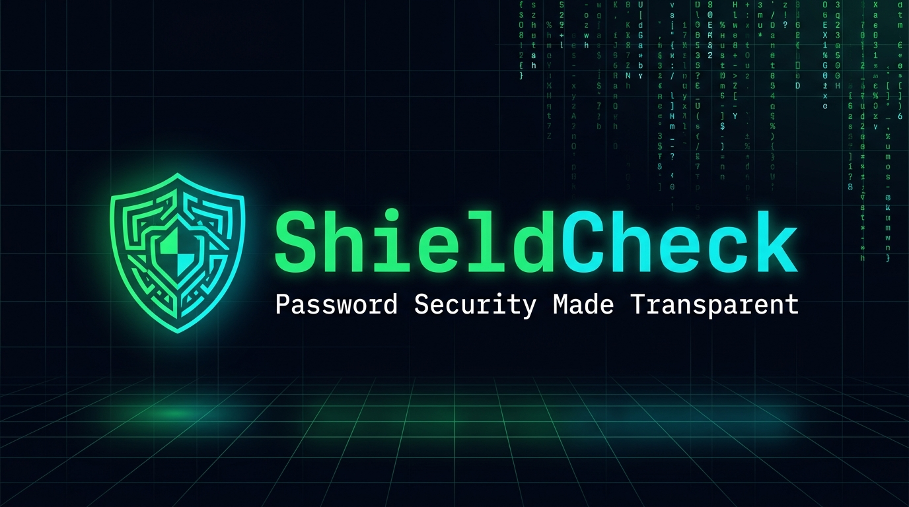
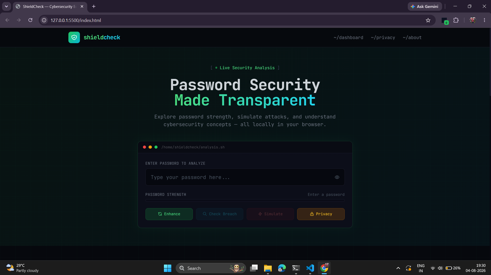
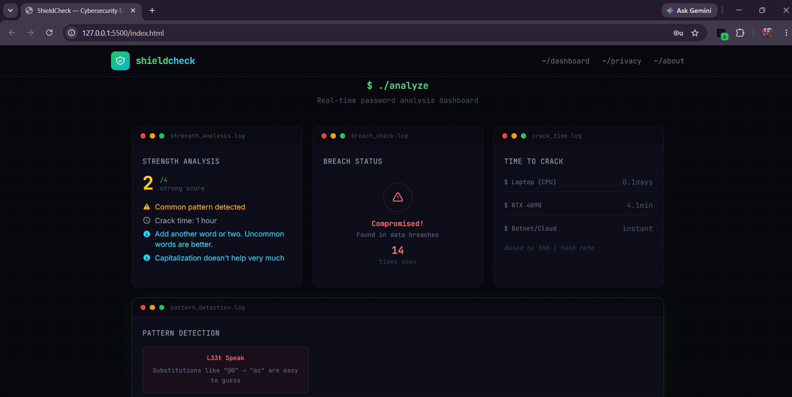
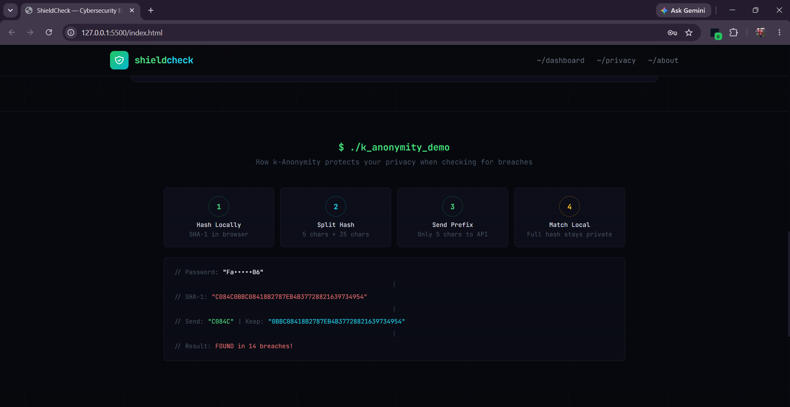

<p align="center">
  
</p>

<h1 align="center">🛡️ ShieldCheck</h1>

<p align="center">
  <strong>Password Security Made Transparent</strong><br/>
  An interactive, browser-based cybersecurity education platform for password analysis, breach detection, and attack simulation — powered entirely by client-side computation.
</p>

<p align="center">
  <a href="#-features"></a>
  <a href="#-privacy--security"></a>
  <a href="#-getting-started"></a>
  <a href="https://github.com/Farhan0629/ShieldCheck"></a>
</p>

<p align="center">
  <a href="https://github.com/Farhan0629/ShieldCheck/stargazers"></a>
  <a href="https://github.com/Farhan0629/ShieldCheck/network/members"></a>
  <a href="https://github.com/Farhan0629/ShieldCheck/issues"></a>
</p>

---

## 📸 Screenshots

<p align="center">
  
  <br/><em>Hero section with terminal-inspired password input interface</em>
</p>

<p align="center">
  
  <br/><em>Real-time analysis dashboard showing strength score, breach status, crack time & pattern detection</em>
</p>

<p align="center">
  
  <br/><em>Interactive k-Anonymity visualizer demonstrating the privacy-preserving breach check protocol</em>
</p>

---

## 📋 Table of Contents

- [Features](#-features)
- [Screenshots](#-screenshots)
- [Architecture](#-architecture)
- [How It Works](#-how-it-works)
- [Tech Stack](#-tech-stack)
- [Getting Started](#-getting-started)
- [Project Structure](#-project-structure)
- [Privacy & Security](#-privacy--security)
- [Contributing](#-contributing)
- [License](#-license)
- [Author](#-author)

---

## ✨ Features

ShieldCheck provides **7 interactive modules** designed to educate users about password security through hands-on exploration:

| Module | Description |
|--------|-------------|
| 🔐 **Password Strength Analysis** | Real-time scoring (0–4) powered by Dropbox's zxcvbn library with actionable feedback |
| 🔍 **Breach Detection** | Privacy-preserving breach check via k-Anonymity protocol against Have I Been Pwned |
| ⏱️ **Crack Time Estimator** | Time-to-crack calculations across 3 hardware tiers (CPU → GPU → Botnet) |
| 🧩 **Pattern Detection** | Identifies L33t speak, keyboard walks, and common year patterns in passwords |
| 🔑 **Passphrase Enhancer** | Generates strong passphrases or intelligently enhances existing passwords |
| ⚔️ **Attack Simulator** | Interactive terminal simulating dictionary, pattern, and brute-force attacks |
| 🛡️ **Privacy Inspector** | Step-by-step visualization of how k-Anonymity protects your data |

---

## 🏗️ Architecture

ShieldCheck is a **zero-backend, single-page application** (SPA). All computation happens in the browser — no server, no database, no tracking. The only external request is a privacy-preserving API call to Have I Been Pwned, and even that never reveals the full password.

```
┌─────────────────────────────────────────────────────────────────────┐
│                          CLIENT (Browser)                          │
│                                                                     │
│  ┌──────────────┐   ┌──────────────┐   ┌──────────────────────┐    │
│  │  index.html  │   │  styles.css  │   │       app.js         │    │
│  │              │   │              │   │                      │    │
│  │  • Structure │   │  • Animations│   │  • Strength Analysis │    │
│  │  • Tailwind  │   │  • Hover FX  │   │  • Breach Check      │    │
│  │    Config    │   │  • Keyframes │   │  • Attack Simulation │    │
│  │  • CDN Links │   │  • Modals    │   │  • Pattern Detection │    │
│  └──────────────┘   └──────────────┘   │  • Passphrase Gen   │    │
│                                         │  • Privacy Inspector │    │
│                                         └──────────┬───────────┘    │
│                                                    │                │
│  ┌─────────────────────────────────────────────────┼──────────┐     │
│  │                  Dependencies                   │          │     │
│  │  ┌────────────┐  ┌──────────────┐  ┌───────────┴────────┐ │     │
│  │  │  zxcvbn    │  │ Tailwind CSS │  │  Web Crypto API    │ │     │
│  │  │  (CDN)     │  │   (CDN)      │  │  (SHA-1, built-in) │ │     │
│  │  └────────────┘  └──────────────┘  └────────────────────┘ │     │
│  └────────────────────────────────────────────────────────────┘     │
│                                                                     │
└───────────────────────────────┬─────────────────────────────────────┘
                                │  Only 5 chars of SHA-1 hash
                                │  (k-Anonymity protocol)
                                ▼
                  ┌──────────────────────────┐
                  │  HIBP API (External)     │
                  │  api.pwnedpasswords.com  │
                  │                          │
                  │  Returns ~500 matching   │
                  │  hash suffixes           │
                  └──────────────────────────┘
```

---

## 🔬 How It Works

### Password Strength Analysis

Uses **[zxcvbn](https://github.com/dropbox/zxcvbn)** — Dropbox's advanced password strength estimator — to evaluate passwords against:

- Dictionary words across multiple languages
- 30,000+ common passwords and patterns
- Keyboard walks (`qwerty`, `asdfgh`, `1qaz2wsx`)
- Date patterns, repeats, and sequences
- L33t substitutions and statistical entropy

Results are displayed on a **5-tier color-coded scale**:

```
█░░░░  Very Weak (0)  →  Red
██░░░  Weak (1)       →  Orange
███░░  Fair (2)       →  Yellow
████░  Strong (3)     →  Lime
█████  Very Strong (4) → Green
```

### Breach Detection via k-Anonymity

Your password is checked against **billions of breached credentials** without ever leaving your device:

```
  ┌──────────────────────────────────────────────────────┐
  │ Step 1: Hash password locally using SHA-1            │
  │         "MySecret123!" → C084C0BBC08418B2787E...     │
  │                                                      │
  │ Step 2: Split hash into prefix + suffix              │
  │         Send: "C084C"  |  Keep: "0BBC08418B..."      │
  │                                                      │
  │ Step 3: API returns ~500 matching hash suffixes      │
  │         GET /range/C084C → 0A1B2C3D...:3, ...        │
  │                                                      │
  │ Step 4: Compare locally — match or no match          │
  │         ✓ Found in N breaches / ✗ Not found          │
  └──────────────────────────────────────────────────────┘
```

> **Why is this secure?** The API only sees 5 hex characters (20 bits of entropy). With ~500 results returned per prefix, the server cannot determine which password is yours. Your full hash never leaves your device.

### Crack Time Estimator

Realistic time-to-crack projections across three hardware tiers:

| Hardware Tier | Hash Rate | Use Case |
|:---|:---|:---|
| 💻 Laptop (CPU) | 10,000 H/s | Single-threaded attack |
| 🖥️ RTX 4090 (GPU) | 200,000 H/s | Consumer GPU attack |
| ☁️ Botnet / Cloud | 100 Billion H/s | Distributed attack |

### Attack Simulator

An interactive terminal that simulates real-world password attacks:

- **Dictionary Attack** — Tests against the top 85 most common passwords with common suffix variations
- **Pattern Attack** — Decodes L33t substitutions, identifies keyboard walks and sequences
- **Brute-Force Attack** — Calculates character-set complexity and simulates progressive keyspace exploration

Each attack renders in a styled terminal with live stats: attempt count, elapsed time, and progress percentage.

---

## 🛠️ Tech Stack

| Technology | Purpose | Source |
|:---|:---|:---|
| **HTML5** | Semantic application structure | Native |
| **CSS3** | Custom animations, transitions & effects | Local (`styles.css`) |
| **Tailwind CSS** | Utility-first styling framework | CDN |
| **JavaScript (ES2017+)** | All application logic (~1250 lines, zero dependencies) | Local (`app.js`) |
| **zxcvbn** | Password strength estimation engine | CDN |
| **Have I Been Pwned API** | Breached credential database | REST API |
| **Web Crypto API** | Cryptographic SHA-1 hashing | Built into all browsers |
| **Google Fonts** | Inter + JetBrains Mono typefaces | CDN |

---

## 🚀 Getting Started

ShieldCheck is a pure frontend application — **no build step, no package manager, no server-side setup required.**

### Prerequisites

- A modern web browser (Chrome 55+, Firefox 52+, Safari 10.1+, Edge 79+)
- Internet connection (for initial CDN loads and breach checking)

### Installation

```bash
# Clone the repository
git clone https://github.com/Farhan0629/ShieldCheck.git

# Navigate to the project directory
cd ShieldCheck
```

### Running Locally

Choose any of the following methods:

<details>
<summary><strong>Option 1: Direct File Open (Simplest)</strong></summary>

Open `index.html` directly in your browser:

```bash
# Windows
start index.html

# macOS
open index.html

# Linux
xdg-open index.html
```

> **Note:** Some browsers restrict `fetch()` over the `file://` protocol. If the breach check doesn't work, use a local server.

</details>

<details>
<summary><strong>Option 2: Python HTTP Server</strong></summary>

```bash
python -m http.server 8080
```

Then open [http://localhost:8080](http://localhost:8080)

</details>

<details>
<summary><strong>Option 3: Node.js HTTP Server</strong></summary>

```bash
npx http-server . -p 8080
```

Then open [http://localhost:8080](http://localhost:8080)

</details>

<details>
<summary><strong>Option 4: VS Code Live Server</strong></summary>

1. Install the **[Live Server](https://marketplace.visualstudio.com/items?itemName=ritwickdey.LiveServer)** extension
2. Right-click `index.html` → **"Open with Live Server"**

</details>

---

## 📁 Project Structure

```
ShieldCheck/
├── index.html          # Application structure, CDN links, Tailwind config
├── styles.css          # Custom CSS animations, transitions, effects
├── app.js              # All application logic (~1250 lines)
├── assets/
│   ├── banner.jpg      # Repository banner
│   ├── screenshot1.png # Hero section screenshot
│   ├── screenshot2.png # Dashboard screenshot
│   └── screenshot3.png # k-Anonymity flow screenshot
└── README.md           # This file
```

### Key Files

| File | Lines | Description |
|:---|:---|:---|
| `index.html` | ~567 | Semantic HTML5 with Tailwind config, navigation, hero, dashboard, modals |
| `styles.css` | ~165 | Custom keyframes (`pulse-alert`, `scan`, `matrix-fall`, `shimmer`), card hover effects, terminal styling |
| `app.js` | ~1250 | Vanilla JS — strength analysis, breach checking, attack simulation, pattern detection, passphrase generation |

---

## 🔒 Privacy & Security

ShieldCheck is built with a **zero-knowledge, privacy-first** architecture:

### ✅ What Stays on Your Device
- Your password (in any form — plaintext, hashed, or partial)
- The full SHA-1 hash
- All keystroke data and analysis results
- All attack simulation data

### 📡 What Leaves Your Device
- **5 characters** of the SHA-1 hash prefix (during breach check only, via k-Anonymity)
- Standard CDN requests for Tailwind CSS, zxcvbn, and Google Fonts (on first load)

### 🔐 Zero-Knowledge Guarantee

The **k-Anonymity** protocol ensures that even if the HIBP API were compromised, an attacker could only determine that your password's hash starts with a specific 5-character prefix — which matches approximately **500 other passwords**. The full hash and original password are mathematically impossible to derive from this prefix alone.

> **No cookies. No analytics. No tracking. No telemetry.**

---

## 🤝 Contributing

Contributions are welcome! Here's how you can help:

1. **Fork** the repository
2. **Create** a feature branch (`git checkout -b feature/amazing-feature`)
3. **Commit** your changes (`git commit -m 'Add amazing feature'`)
4. **Push** to the branch (`git push origin feature/amazing-feature`)
5. **Open** a Pull Request

### Ideas for Contribution

- [ ] Add password generation with customizable rules
- [ ] Implement additional attack simulation types
- [ ] Add multi-language support (i18n)
- [ ] Create a browser extension version
- [ ] Add accessibility (a11y) improvements

---

## 📄 License

This project is open source and available under the [MIT License](LICENSE).

---

## 👤 Author

**Farhan Naser**

- GitHub: [@Farhan0629](https://github.com/Farhan0629)

---

<p align="center">
  <strong>If you found ShieldCheck useful, consider giving it a ⭐ on GitHub!</strong>
</p>

<p align="center">
  <a href="https://github.com/Farhan0629/ShieldCheck">
    
  </a>
</p>
